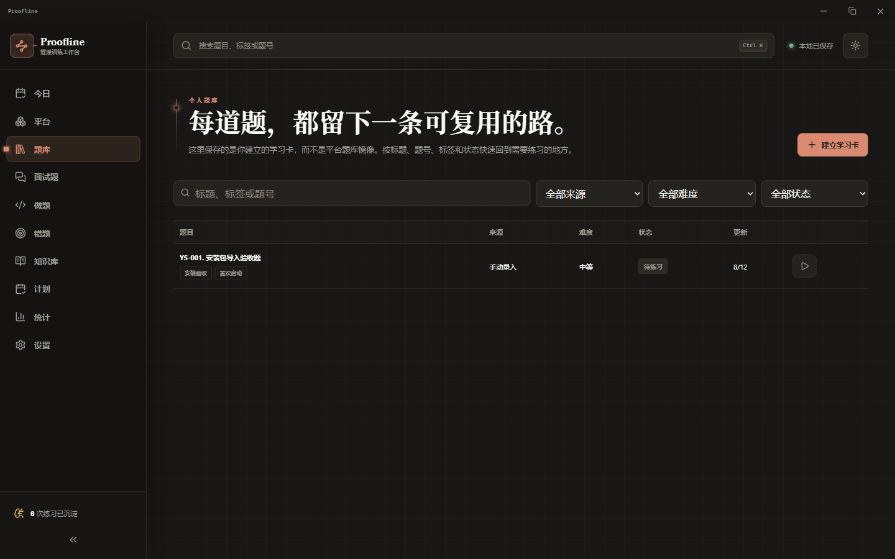

# Proofline

<p align="center">
  
</p>

<p align="center">
  <strong>把“看懂一道题”，变成“下次能独立写出来”。</strong><br />
  本地优先的 Windows 算法与企业面试训练工作台。
</p>

<p align="center">
  <a href="https://github.com/Lzh41/Proofline/releases"></a>
  <a href="https://github.com/Lzh41/Proofline/actions"></a>
  <a href="https://github.com/Lzh41/Proofline/releases"></a>
  <a href="https://github.com/Lzh41/Proofline"></a>
</p>

> 当前版本：`0.1.1` · Windows x64 · Tauri 2 · React 19 · SQLite

## 先看它在做什么

刷题最容易卡在三个瞬间：题面读懂了却不会下手，代码跑不通却不知道错在哪里，做完之后过几天又像第一次见。Proofline 把这三个瞬间串成一条可回看的学习轨迹：

| 学习环节 | 你在 Proofline 里做什么 | 系统留下什么 | 下一步会发生什么 |
| --- | --- | --- | --- |
| **1 · 选题** | 从题库、岗位方向或官方平台选一道题 | 题面、标签、难度和来源 | 自动进入这道题的专属学习卡 |
| **2 · 拆题** | 阅读约束，写下观察，向 AI 教练提问 | 你的思路、提示和对话记录 | 把抽象题意变成可执行的算法计划 |
| **3 · 编码** | 在编辑器中直接写代码，不需要手写测试入口 | 当前代码、运行时间和每次尝试 | 一键运行全部样例并逐条反馈 |
| **4 · 复盘** | 通过就整理可复用方法，失败就记录错因 | 结果、错因、算法逻辑和复盘笔记 | 失败题进入复习队列，到期自动提醒 |
| **5 · 回看** | 按每日计划重新挑战，验证是否真的掌握 | 掌握度、复习历史和薄弱标签 | 题目从“做过”变成“下次能独立写出” |

**一眼看懂这条闭环：** 选题 → 拆题 → 编码 → 跑全样例 → 复盘 → 间隔复习 → 再次独立完成。<br />
如果样例失败，流程会回到 **AI 解惑与算法逻辑拆解**；如果通过，系统会把这次成功经验保存为下一次的起点。

题目不再只是列表里的一行文字，而会逐渐长出自己的“记忆”：你的代码、运行结果、错因、提示、复盘和下一次复习时间都留在同一张学习卡里。

## 功能地图

### 算法题：从题面到可运行代码

- **题面置顶**：题目、约束、样例和函数签名固定在视线前方，代码编辑区与 AI 教练左右排布。
- **完整样例运行**：一次点击逐条执行全部样例，不需要手写 `main`、测试函数或测试入口；全部通过就自动完成本次练习，汇总结果会告诉你是哪一条失败。
- **算法逻辑拆解**：不只给结论，AI 会解释“为什么选这个算法”“状态如何转移”“这一行代码对应哪一步思路”。
- **连续提问**：可以直接问“这段循环为什么从这里开始”“为什么要先排序”，回答会保留在题目的对话记录中。
- **代码尺寸可调**：适合长时间练习，也适合在小窗口里快速复盘。

### 企业面试：按岗位准备，而不是盲目刷题

- **21 个岗位方向、1083 道题**：覆盖大语言模型、NLP、RAG、推荐系统、后端、前端、测试、数据、机器学习等方向。
- **组合检索**：岗位、关键词、八股主题、题型、难度和掌握度可以一起筛选。
- **AI 面试出题官**：输入 `Transformer`、`RAG` 或“搜索排序”，生成考点地图、面试问题、参考答案和递进追问。
- **一键收入个人题库**：勾选出题官生成的题目后直接保存，避免复制粘贴和重复整理。
- **真实回答闭环**：回答草稿自动保存，提交后查看参考答案、遗漏点和改进表达，再选择“掌握 / 模糊 / 不会”。

### 记忆系统：让练习留下复利

- **错题复习**：按 `1 / 3 / 7 / 14 / 30` 天安排复习，失败自动回到 1 天。
- **每日计划**：先处理到期复习，再按薄弱标签、岗位方向和新题目标补齐。
- **知识库**：笔记支持全文检索，可关联题目与错题，把零散的八股答案整理成自己的知识网络。
- **AI 练习分析**：知识库会只取上次分析之后新增的已完成题目，按共同考点、逐题思路、错误模式和复习清单生成一篇可回看的本地笔记；重复点击不会重复分析旧题。
- **统计面板**：查看练习次数、通过率、专注时间、算法掌握度和岗位薄弱项。

### 平台连接：尊重官方页面，也保留学习连续性

Proofline 可以打开力扣中国、LeetCode 和牛客的官方页面，并从当前用户选择的公开单题建立学习卡。页面遇到登录、验证码、改版或反爬限制时，会保留链接型卡片，并提供手工录入、剪贴板和截图 OCR 回退。

## 一次完整练习是什么样

1. 在“题库”或官方平台窗口选择一道题。
2. 开始计时，先写下自己的观察，再进入代码区。
3. 运行全部样例，查看每一条输入与输出结果。
4. 卡住时直接问 AI：让它解释算法逻辑、当前代码、报错或下一步实现。
5. 结束后记录错因和思路，失败题自动进入错题复习队列。
6. 下一次打开 Proofline，今日计划会优先把它带回来。

## 下载与安装

前往 [Releases](https://github.com/Lzh41/Proofline/releases) 下载：

- `Proofline_0.1.3_x64-setup.exe`：Windows x64 安装版，可指定安装路径。
- `Proofline_0.1.3_x64-portable.exe`：Windows x64 便携版，免安装运行。

当前版本未配置商业代码签名证书，Windows SmartScreen 可能显示“未知发布者”。下载后请先核对 Release 页面中的 SHA-256。若系统没有 WebView2 Runtime，安装阶段需要联网下载安装运行时。

首次启动会在 `%LOCALAPPDATA%\Proofline` 创建 SQLite 数据库，并自动写入内置面试题库。旧版本已有 `%LOCALAPPDATA%\Xiti` 数据时会继续使用原目录，确保题目、错题和 AI 凭据不丢失。卸载默认保留个人数据；彻底清理请先在“设置 → 删除本机数据”中明确选择。

## AI 与隐私边界

AI 使用 OpenAI 兼容接口。你可以在设置中填写基础地址、模型 ID 和密钥；密钥由 Rust 写入 Windows 凭据库，前端不能读取明文，也不会进入 SQLite、JSON 导出或 ZIP 备份。发送题面、代码或笔记前会显示隐私确认。

Proofline 不批量抓取或镜像力扣、LeetCode、牛客的完整题库，不读取 Cookie，也不代替用户提交代码。官方平台窗口拥有独立的 WebView2 数据目录，主窗口 IPC、SQLite、文件和凭据不会暴露给远程页面。

## 本地开发

环境要求：Node.js 20+、Rust stable MSVC、Visual Studio 2022 C++ 工具链、Windows SDK 和 WebView2 Runtime。

```powershell
git clone https://github.com/Lzh41/Proofline.git
cd Proofline
npm ci
npm run dev
```

浏览器预览使用 `localStorage`，不能代表 Windows 凭据库、SQLite 和官方平台窗口的完整行为。构建 Windows 安装包：

```powershell
.\scripts\tauri-msvc.ps1 -Mode build
```

## 数据位置

| 数据 | 默认位置 |
| --- | --- |
| SQLite 数据库 | `%LOCALAPPDATA%\Proofline\proofline.sqlite`（旧版本兼容 `%LOCALAPPDATA%\Xiti\xiti.sqlite`） |
| 附件 | `%LOCALAPPDATA%\Proofline\attachments`（旧版本兼容 `%LOCALAPPDATA%\Xiti\attachments`） |
| 平台登录目录 | `%LOCALAPPDATA%\Proofline\platforms\<平台>`（旧版本兼容 `%LOCALAPPDATA%\Xiti\platforms\<平台>`） |
| ZIP 备份 | `%USERPROFILE%\Documents\Proofline\备份`（旧版本兼容 `%USERPROFILE%\Documents\析题\备份`） |
| AI 密钥 | Windows 凭据库 `com.xiti.desktop` |

备份包含 SQLite 快照和附件，不包含 AI 密钥、平台登录目录或 Cookie。

## 技术栈

React 19 · TypeScript · Vite · Tauri 2 · Rust · SQLite · Zustand · CSS Modules · Lucide · Monaco Editor · Tesseract WASM · Pyodide

## 验证记录

- 前端测试：`32` 个测试文件，`201/201` 通过。
- Rust 测试：`63/63` 通过。
- Windows x64 NSIS 安装包和便携版已构建。
- 已在全新安装目录验证：首次启动、导入题目、完全退出、重启后数据持久化。

## 参与贡献

欢迎提交 Issue 和 Pull Request。请先阅读 [贡献指南](CONTRIBUTING.md)；涉及平台连接器、隐私、凭据或本地执行器的改动，请同时说明安全边界和测试方式。

## 许可证

当前仓库暂未授予第三方复制、修改或分发代码的许可。你可以通过 Issue 讨论使用授权或合作方式。
